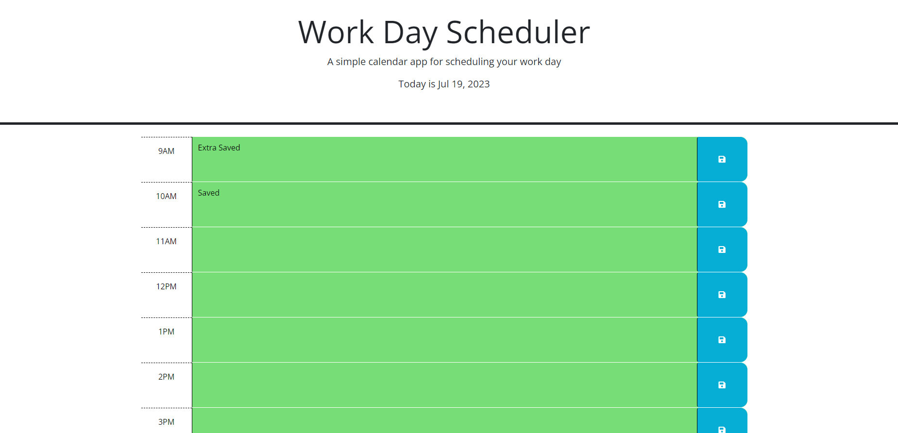

# Work-Day-Scheduler

## Description

The goal for this project was to create a scheduler that could organize and color code your tasks for the day, while also storing them so you didn't lose any of your inputs. This can be a very useful tool for anyone, like myself, who struggles with remembering small tasks that they need to complete in between big projects. This project was very helpful to me in learning how to put together something that sounded complex in a relatively simple waw, by breaking it down into small pieces instead of trying to tackle everything at once.

## Table of Contents

N/A

## Installation

N/A

## Usage

## Credits

Class material, and TA Samuel Cordova with cleaning up the local storage functions, and the click functions as seen on lines 25, 26, 28, and 33-35 of the JavaScript.
